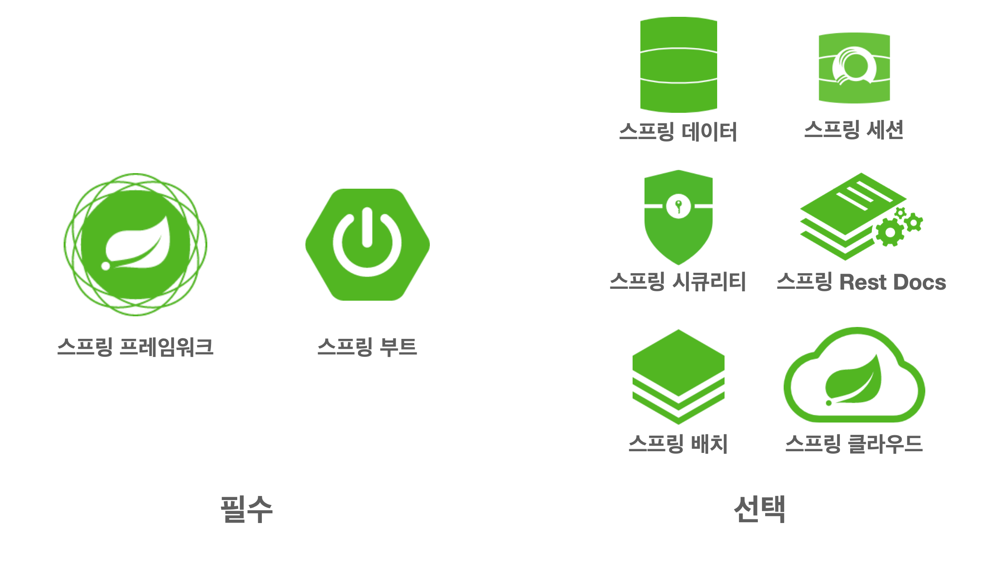
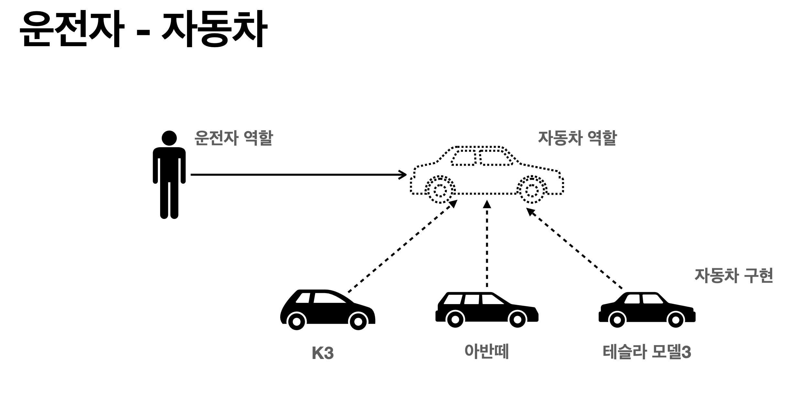
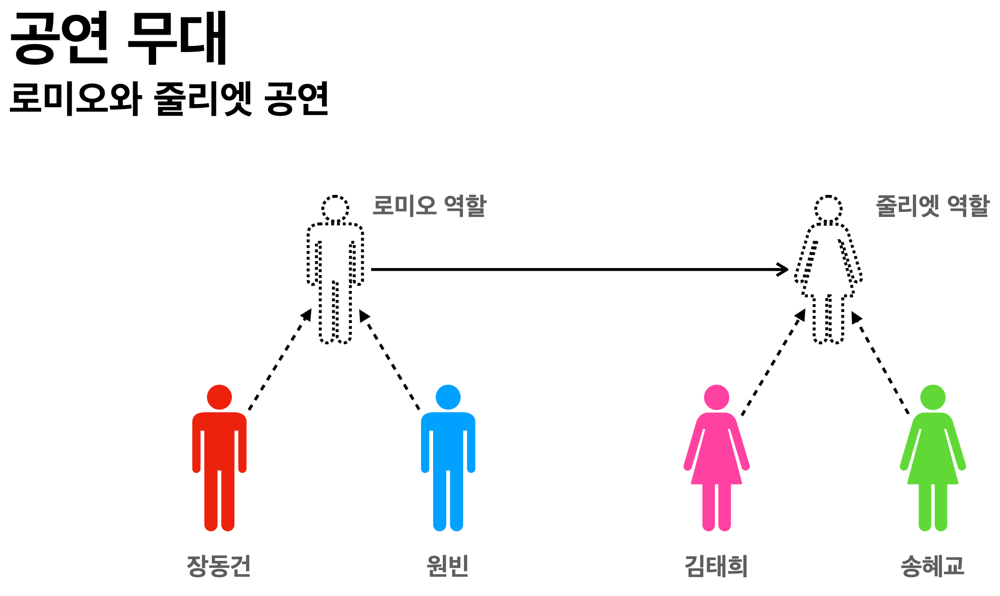
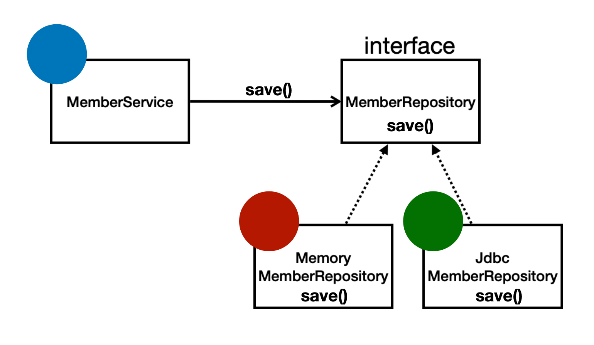

# 객체 지향 설계과 스프링

## 1. 자바 진영의 추운 겨울과 스프링의 탄생
 
### EJB
**태초에 스프링 전에 있던 웹 서버 프레임워크**
이론적으로 훌륭하지만 어렵고 복잡하고 느리고 비쌈

이 지옥에서 로드 존슨이 EJB를 비판하면서 단순하고 좋은 방법이라는 주제로 책을 쓰는데 이게 스프링의 시초이다, EJB 엔티티빈 기술을 대체하기 위해서 나온게 하이버네이트
이 하이버네이트가 결국 JPA가 된다 

### 스프링의 역사

- 2002년 로드 존슨 책 출간 EJB의 문제점 지적
- EJB 없이도 충분히 고품질의 확장 가능한 어플리케이션을 개발할 수 있음을 보여주고, 30,000라인 이상의 기반 기술을 예제 코드로 선보임
- 여기에 지금의 스프링 핵심 개념과 기반 코드가 들어 가 있음
- BeanFactory, ApplicationContext, POJO, 제 어의 역전, 의존관계 주입
- 책이 유명해지고, 개발자들이 책의 예제 코드를 프로 젝트에 사용

## 2. 스프링이란?


스프링은 여러가지 기술들의 모음이라 할 수 있다

스프링에 핵심이 되는 스프링 프레임워크, 여러 스프링 기술들을 편리하게 사용할 수 있게 도와주는 스프링 부트

- 스프링 데이터: RDB, NoSQL이든 CRUD는 똑같은데 이런것들을 편리하게 사용할 수 있게 해주는 기술
- 스프링 세션: 세션 기능을 편리하게 사용할 수 있게 해주는 기술
- 스프링 시큐리티: 보안 관련된 기술
- 스프링 Rest Docs: api명세서를 편리하게 사용할 수 있게 해주는 기술
- 스프링 배치: 1000만건 있는 데이터를 한번에 업데이트 하긴 어려우니까 100만건씩 퍼올려서 저장하는 배치처리에 특화된 기술
- 스프링 클라우드: 클라우드 기술

이거 말고도 많은 기술들이 있다

### 스프링 프레임워크

- 핵심 기술: 스프링 DI 컨테이너, AOP, 이벤트, 기타
- 웹 기술: 스프링 MVC, 스프링 WebFlux
- 데이터 접근 기술: 트랜잭션, JDBC, ORM 지원, XML 지원
- 기술 통합: 캐시, 이메일, 원격접근, 스케줄링
- 테스트: 스프링 기반 테스트 지원
- 언어: 코틀린, 그루비
- 최근에는 스프링 부트를 통해서 스프링 프레임워크의 기술들을 편리하게 사용

### 스프링 부트

- 스프링을 편리하게 사용할 수 있도록 지원, 최근에는 기본으로 사용
- 단독으로 실행할 수 있는 스프링 애플리케이션을 쉽게 생성 
- Tomcat 같은 웹 서버를 내장해서 별도의 웹 서버를 설치하지 않아도 됨 -> 예전에는 톰캣을 따로 다운받아서 빌드한 프로젝트를 넣고 띄워야됬음
- 손쉬운 빌드 구성을 위한 starter 종속성 제공 -> starter가 나머지 라이브러리를 알아서 땡겨옴
- 스프링과 3rd party(외부) 라이브러리 자동 구성 -> 외부 라이브러리와의 버전 호환성을 맞춰줌
- 메트릭, 상태 확인, 외부 구성 같은 프로덕션 준비 기능 제공
- 관례에 의한 간결한 설정

### 그래서 스프링이 뭔데?

- 스프링이라는 단어는 문맥에 따라 다르게 사용된다.
  - 스프링 DI 컨테이너 기술 
  - 스프링 프레임워크 
  - 스프링 부트, 스프링 프레임워크 등을 모두 포함한 스프링 생태계

### 스프링의 진짜 핵심

- 스프링은 자바 언어 기반의 프레임워크
- 자바 언어의 가장 큰 특징 - 객체 지향 언어
- EJB는 EJB에 의존적으로 개발해야되서 객체지향적인 장점을 잃어버렸다
- 스프링은 객체 지향 언어가 가진 강력한 특징을 살려내는 프레임워크
- 스프링은 좋은 객체 지향 애플리케이션을 개발할 수 있게 도와주는 프레임워크

**그렇다면 좋은 객체 지향은 뭘까?**

## 3. 좋은 객체 지향 프로그래밍

- 객체 지향 프로그래밍은 컴퓨터 프로그램을 명령어의 목록으로 보는 시각에서 벗어나 여러 개의 독립된 단위, 즉 "객체"들의 모임으로 파악하고자 하는 것이다.
각각의 객체는 메시지 를 주고받고, 데이터를 처리할 수 있다. (협력)
- 객체 지향 프로그래밍은 프로그램을 유연하고 변경이 용이하게 만들기 때문에 대규모 소프 트웨어 개발에 많이 사용된다.

### 객체 지향 특징
- 추상화
- 캡슐화
- 상속
- 다형성

### 유연하고 변경이 용이한게 뭘까?
- 레고 블럭 조립하듯이
- 키보드, 마우스 갈아 끼우듯이
- 컴퓨터 부품 갈아 끼우듯이
- 컴포넌트를 쉽고 유연하게 변경하면서 개발할 수 있는 방법

### 다형성의 실세계 비유
역할과 구현으로 세상을 구분 해보자



K3를 타다가 아반떼로 차를 변경하면 자동차 운전하는데 영향을 줄까? 운전면허가 있다면 똑같이 핸들 브레이크 엑셀 기능이 다 똑같다. 자동차 역할의 인터페이스를 따라서
자동차를 구현했기 때문에 운전자는 자동차 인터페이스만 알면 된다(자동차 인터페이스만 의존하면 된다) 이렇게 자동차 세상은 무한히 확장 가능하다


대본이 있다면 배우는 대체 가능해야 한다 로미오는 줄리엣 역할을 김태희가 하던 송혜교가 하던 상관 없다

- 역할과 구현으로 구분하면 세상이 단순해지고, 유연해지며 변경도 편리해진다.
- 장점 
  - 클라이언트는 대상의 역할(인터페이스)만 알면 된다. 
  - 클라이언트는 구현 대상의 내부 구조를 몰라도 된다. 
  - 클라이언트는 구현 대상의 내부 구조가 변경되어도 영향을 받지 않는다. 
  - 클라이언트는 구현 대상 자체를 변경해도 영향을 받지 않는다.

- 자바 언어의 다형성을 활용
  - 역할 = 인터페이스 
  - 구현 = 인터페이스를 구현한 클래스, 구현 객체 
  - 객체를 설계할 때 역할과 구현을 명확히 분리 
  - 객체 설계시 역할(인터페이스)을 먼저 부여하고, 그 역할을 수행하는 구현 객체 만들기

### 자바 언어의 다형성


- 오버라이딩을 떠올려보자
- 오버라이딩은 자바 기본 문법
- 오버라이딩 된 메서드가 실행 
- 다형성으로 인터페이스를 구현한 객체 를 실행 시점에 유연하게 변경할 수 있다. 
- 물론 클래스 상속 관계도 다형성, 오버 라이딩 적용가능
- 클라이언트가 MemberService 보고 클라이언트는 MemberRepository에 의존한다 그럼 여기에 Memory나 Jdbc 를 할당할 수 있다
```java
public class MemberService {
    private MemberRepository memberRepository = new MemoryMemberRepository();
    private MemberRepository memberRepository = new JdbcMemberRepository();
}
```

### 다형성의 본질

- 인터페이스를 구현한 객체 인스턴스를 실행 시점에 유연하게 변경할 수 있다. 
- 다형성의 본질을 이해하려면 협력이라는 객체사이의 관계에서 시작해야함 
- 클라이언트를 변경하지 않고, 서버의 구현 기능을 유연하게 변경할 수 있다.

### 정리
- 실세계의 역할과 구현이라는 편리한 컨셉을 다형성을 통해 객체 세상으로 가져올 수 있음
- 유연하고, 변경이 용이 
- 확장 가능한 설계 
- 클라이언트에 영향을 주지 않는 변경 가능 
- 인터페이스를 안정적으로 잘 설계하는 것이 중요

### 한계
- 역할(인터페이스) 자체가 변하면, 클라이언트, 서버 모두에 큰 변경이 발생한다.
- 자동차를 비행기로 변경해야 한다면? 
- 대본 자체가 변경된다면? 
- USB 인터페이스가 변경된다면? 
- 인터페이스를 안정적으로 잘 설계하는 것이 중요

### 스프링과 객체 지향

- 다형성이 가장 중요하다!
- 스프링은 다형성을 극대화해서 이용할 수 있게 도와준다.
- 스프링에서 이야기하는 제어의 역전(IoC), 의존관계 주입(DI)은 다형성을 활용하여 역화과 구현을 편리하게 다룰 수 있도록 지원한다.
- 스프링을 사용하면 마치 레고 블럭 조립하듯이! 공연 무대의 배우를 선택하듯이! 구현을 편리하게 변경할 수 있다.
- 어쩌면 스프링 컨테이너가 지원하는 기능은 다형성을 편리하게 제공할 수 있는 기능을 제공하는게 전부라고 볼 수 있다

## 4. 좋은 객체 지향 설계의 5가지 원칙(SOLID)

**클린코드로 유명한 로버트 마틴이 좋은 객체 지향 설꼐의 5가지 원칙을 정리**
- SRP: 단일 책임 원칙(single responsibility principle)
- OCP: 개방-폐쇄 원칙 (Open/closed principle)
- LSP: 리스코프 치환 원칙 (Liskov substitution principle)
- ISP: 인터페이스 분리 원칙 (Interface segregation principle)
- DIP: 의존관계 역전 원칙 (Dependency inversion principle)

### SRP 단일 책임 원칙
Single responsibility principle

- 한 클래스는 하나의 책임만 가져야 한다. 
- 하나의 책임이라는 것은 모호하다. 
  - 클 수 있고, 작을 수 있다. 
  - 문맥과 상황에 따라 다르다. 
- 중요한 기준은 변경이다. 변경이 있을 때 파급 효과가 적으면 단일 책임 원칙을 잘 따른 것 
- 예) UI 변경, 객체의 생성과 사용을 분리

### OCP 개방-폐쇄 원칙
Open/closed principle

- 소프트웨어 요소는 확장에는 열려 있으나 변경에는 닫혀 있어야 한다 
- 이런 거짓말 같은 말이? 확장을 하려면, 당연히 기존 코드를 변경해야하지 않나?
- 다형성을 활용해보자 
- 인터페이스를 구현한 새로운 클래스를 하나 만들어서 새로운 기능을 구현
- 지금까지 배운 역할과 구현의 분리를 생각해보자 -> 자동차가 기름에서 전기로 바껴도 운전자는 변경하지 않아도 된다

```java
public class MemberService {
    private MemberRepository memberRepository = new MemoryMemberRepository();
    private MemberRepository memberRepository = new JdbcMemberRepository();
}
```

문제점
- MemberService 클라이언트가 구현 클래스를 직접 선택
  - MemberRepository m = new MemoryMemberRepository(); //기존 코드 
  - MemberRepository m = new JdbcMemberRepository(); //변경 코드 
- 구현 객체를 변경하려면 클라이언트 코드를 변경해야 한다. 
- 분명 다형성을 사용했지만 OCP 원칙을 지킬 수 없다. 
- 이 문제를 어떻게 해결해야 하나? 
- 객체를 생성하고, 연관관계를 맺어주는 별도의 조립, 설정자가 필요하다.

### LSP 리스코프 치환 원칙
Liskov substitution principle

- 프로그램의 객체는 프로그램의 정확성을 깨뜨리지 않으면서 하위 타입의 인스턴스로 바꿀 수 있어야 한다 
- 다형성에서 하위 클래스는 인터페이스 규약을 다 지켜야 한다는 것, 다형성을 지원하기 위 한 원칙, 인터페이스를 구현한 구현체는 믿고 사용하려면, 이 원칙이 필요하다. 
- 단순히 컴파일에 성공하는 것을 넘어서는 이야기 
- 예) 자동차 인터페이스의 엑셀은 앞으로 가라는 기능, 뒤로 가게 구현하면 LSP 위반, 느리 더라도 앞으로 가야함

### ISP 인터페이스 분리 원칙
Interface segregation principle

- 특정 클라이언트를 위한 인터페이스 여러 개가 범용 인터페이스 하나보다 낫다
- 자동차 인터페이스 -> 운전 인터페이스, 정비 인터페이스로 분리 
- 사용자 클라이언트 -> 운전자 클라이언트, 정비사 클라이언트로 분리 
- 분리하면 정비 인터페이스 자체가 변해도 운전자 클라이언트에 영향을 주지 않음
- 인터페이스가 명확해지고, 대체 가능성이 높아진다.

### DIP 의존관계 역전 원칙
Dependency inversion principle

- 프로그래머는 “추상화에 의존해야지, 구체화에 의존하면 안된다.” 의존성 주입은 이 원칙 을 따르는 방법 중 하나다. 
- 쉽게 이야기해서 구현 클래스에 의존하지 말고, 인터페이스에 의존하라는 뜻 
- 앞에서 이야기한 역할(Role)에 의존하게 해야 한다는 것과 같다. 객체 세상도 클라이언트 가 인터페이스에 의존해야 유연하게 구현체를 변경할 수 있다!
구현체에 의존하게 되면 변 경이 아주 어려워진다.
- 운전자는 자동차의 역할만 알아야지 k3에 의존하면 안된다, 원빈은 상대역으로 줄리엣을 알아야지 김태희에 의존하면 안된다 
- 그런데 OCP에서 설명한 MemberService는 인터페이스에 의존하지만, 구현 클래스도 동시에 의존한다. 
- MemberService 클라이언트가 구현 클래스를 직접 선택 
  - MemberRepository m = new ~~MemoryMemberRepository~~(); 
- DIP 위반

### 정리

- 객체 지향의 핵심은 다형성 
- 다형성 만으로는 쉽게 부품을 갈아 끼우듯이 개발할 수 없다. 
- 다형성 만으로는 구현 객체를 변경할 때 클라이언트 코드도 함께 변경된다.
- 다형성 만으로는 OCP, DIP를 지킬 수 없다. 
- 뭔가 더 필요하다.

## 5. 객체 지향 설계와 스프링

### 다시 스프링으로

**스프링 이야기에 왜 객체 지향 이야기가 나오는가?**
- 스프링은 다음 기술로 다형성 + OCP, DIP를 가능하게 지원
  - DI(Dependency Injection): 의존관계, 의존성 주입
  - DI 컨테이너 제공 
- 클라이언트 코드의 변경 없이 기능 확장
- 쉽게 부품을 교체하듯이 개발

### 스프링이 없던 시절로

- 옛날 어떤 개발자가 좋은 객체 지향 개발을 하려고 OCP, DIP 원칙을 지키면서 개발을 해 보니, 너무 할일이 많았다. 배보다 배꼽이 크다. 그래서 프레임워크로 만들어버림 
- 순수하게 자바로 OCP, DIP 원칙들을 지키면서 개발을 해보면, 결국 스프링 프레임워크를 만들게 된다. (더 정확히는 DI 컨테이너)
- DI 개념은 말로 설명해도 이해가 잘 안된다. 코드로 짜봐야 필요성을 알게된다! 
- 그러면 이제 스프링이 왜? 만들어졌는지 코드로 이해해보자

### 정리
- 모든 설계에 역할과 구현을 분리하자. 
- 자동차, 공연의 예를 떠올려보자.
- 애플리케이션 설계도 공연을 설계 하듯이 배역만 만들어두고, 배우는 언제든지 유연하게 변경할 수 있도록 만드는 것이 좋은 객체 지향 설계다.
- 이상적으로는 모든 설계에 인터페이스를 부여하자 
- 하지만 인터페이스를 도입하면 추상화라는 비용이 발생한다. 
- 기능을 확장할 가능성이 없다면, 구체 클래스를 직접 사용하고, 향후 꼭 필요할 때 리팩터링해서 인터페이스를 도입하는 것도 방법이다.

**실무 고민**
- 하지만 인터페이스를 도입하면 추상화라는 비용이 발생한다. -> 나중에 개발자가 구현 코드를 한번 더 까봐야 한다
- 기능을 확장할 가능성이 없다면, 구체 클래스를 직접 사용하고, 향후 꼭 필요할 때 리팩터 링해서 인터페이스를 도입하는 것도 방법이다.
- 장점이 단점을 넘어설 때 사용해야 한다