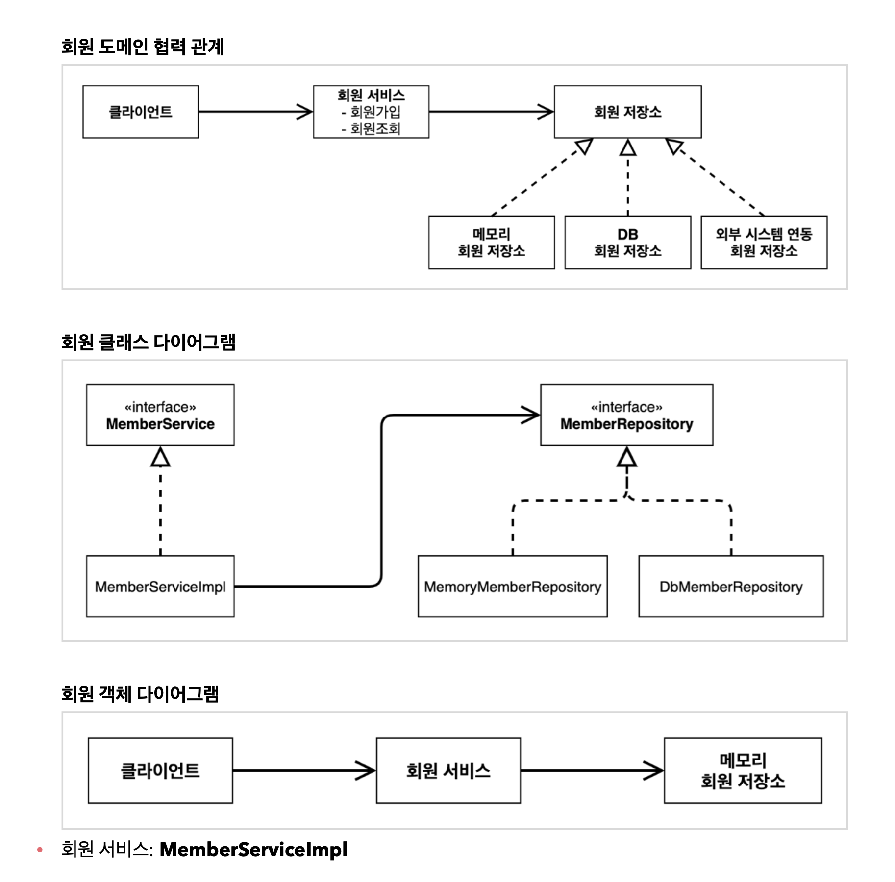
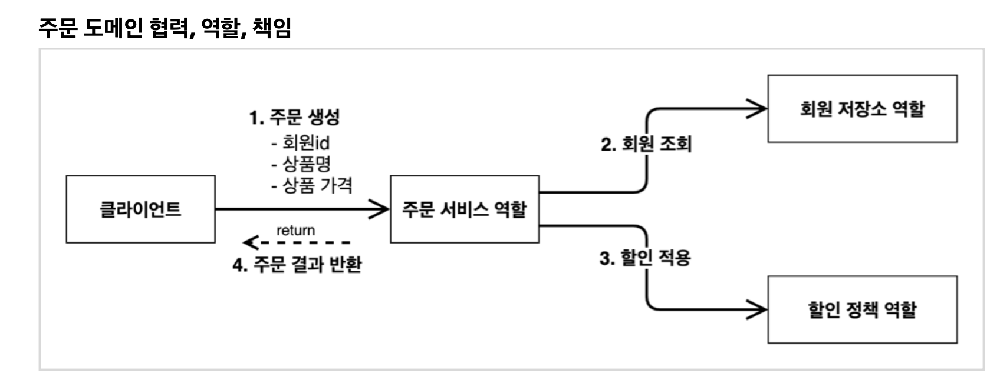
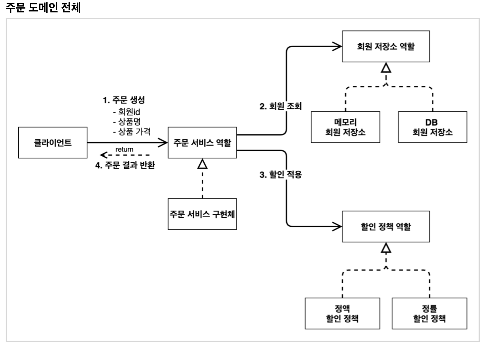
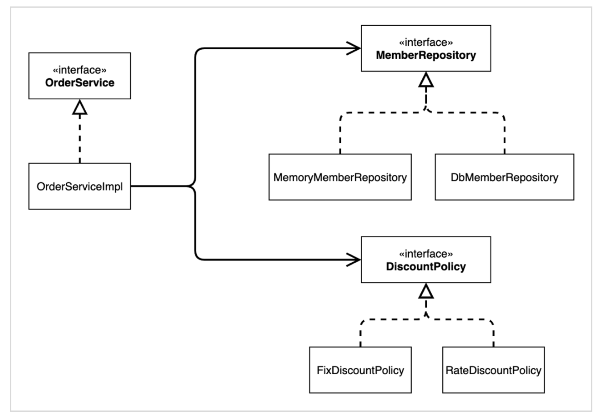
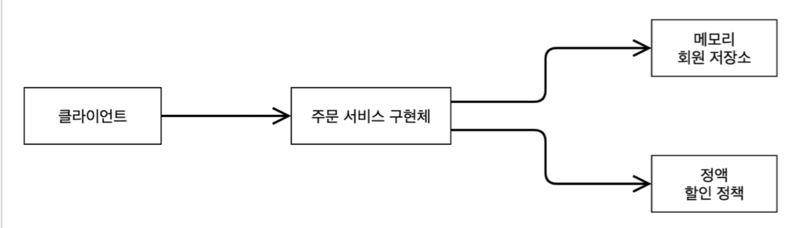
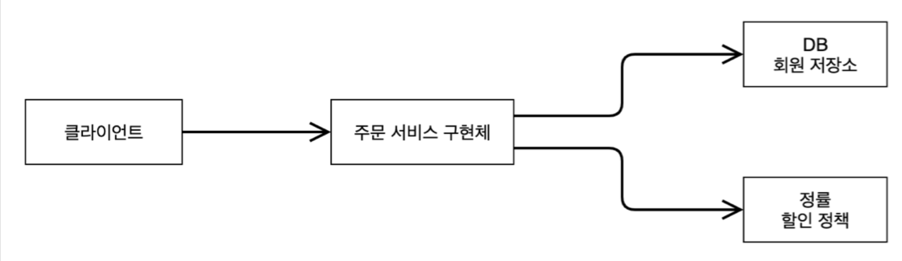

# 스프링 핵심 원리 이해1 - 기제 만들

## 1. 비즈니스 요구사항과 설계
- 회원
  - 회원을 가입하고 조회할 수 있다. 
  - 회원은 일반과 VIP 두 가지 등급이 있다. 
  - 회원 데이터는 자체 DB를 구축할 수 있고, 외부 시스템과 연동할 수 있다. (미확정)
- 주문과 할인 정책 
  - 회원은 상품을 주문할 수 있다. 
  - 회원 등급에 따라 할인 정책을 적용할 수 있다. 
  - 할인 정책은 모든 VIP는 1000원을 할인해주는 고정 금액 할인을 적용해달라. (나중에 변경 될 수 있다.)
  - 할인 정책은 변경 가능성이 높다. 회사의 기본 할인 정책을 아직 정하지 못했고, 오픈 직전까지 고민을 미루고 싶다. 최악의 경우 할인을 적용하지 않을 수 도 있다. (미확정)
요구사항을 보면 회원 데이터, 할인 정책 같은 부분은 지금 결정하기 어려운 부분이다. 그렇다고 이런 정책이 결정될 때 까지 개발을 무기한 기다릴 수 도 없다. 우리는 앞에서 배운 객체 지향 설계 방법이 있지 않은가!
인터페이스를 만들고 구현체를 언제든지 갈아끼울 수 있도록 설계하면 된다. 그럼 시작해보자.
> 참고: 프로젝트 환경설정을 편리하게 하려고 스프링 부트를 사용한 것이다. 지금은 스프링 없는 순수한
자바로만 개발을 진행한다는 점을 꼭 기억하자! 스프링 관련은 한참 뒤에 등장한다.

## 2. 회원 도메인 설계
- 회원 도메인 요구사항 
  - 회원을 가입하고 조회할 수 있다. 
  - 회원은 일반과 VIP 두 가지 등급이 있다. 
  - 회원 데이터는 자체 DB를 구축할 수 있고, 외부 시스템과 연동할 수 있다. (미확정)



### 등급
```java
  public enum Grade {
      BASIC,
        VIP 
}
```

### 회원 엔티티
```java
@Getter @Setter
 public class Member {
      private Long id;
      private String name;
      private Grade grade;
      
      public Member(Long id, String name, Grade grade) {
          this.id = id;
          this.name = name;
          this.grade = grade;
  }
}
```

### 회원 저장소 인터페이스
```java
public interface MemberRepository {
      void save(Member member);
      Member findById(Long memberId);
}

```

### 메모리 회원 저장소 구현체

```java
public class MemoryMemberRepository implements MemberRepository { 
    private static Map<Long, Member> store = new HashMap<>();
    @Override 
    public void save(Member member) {
        store.put(member.getId(), member);
    }
    @Override 
    public Member findById(Long memberId) {
    return store.get(memberId);
  }
}
```

### 회원 서비스 인터페이스
```java
public interface MemberService {
        void join(Member member);
        Member findMember(Long memberId);
}

```

### 회원 서비스 구현체
```java
public class MemberServiceImpl implements MemberService { 
    private final MemberRepository memberRepository = new MemoryMemberRepository();
    public void join(Member member) {
        memberRepository.save(member);
    }
    public Member findMember(Long memberId) {
        return memberRepository.findById(memberId);
    }
}
    
```

### 회원 도메인 - 회원 가입 테스트
```java
class MemberServiceTest {
      MemberService memberService = new MemberServiceImpl();
      @Test
      void join() {
          //given
          Member member = new Member(1L, "memberA", Grade.VIP);
          //when
          memberService.join(member);
          Member findMember = memberService.findMember(1L);
          //then
          Assertions.assertThat(member).isEqualTo(findMember);
      }
}
```

### 회원 도메인 설계의 문제점
- 이 코드의 설계상 문제점은 무엇일까요?
- 다른 저장소로 변경할 때 OCP 원칙을 잘 준수할까요? 
- DIP를 잘 지키고 있을까요? 
- 의존관계가 인터페이스 뿐만 아니라 구현까지 모두 의존하는 문제점이 있음 
- 주문까지 만들고나서 문제점과 해결 방안을 설명


## 3. 주문과 할인 도메인 설계
- 주문과 할인 정책 
  - 회원은 상품을 주문할 수 있다. 
  - 회원 등급에 따라 할인 정책을 적용할 수 있다. 
  - 할인 정책은 모든 VIP는 1000원을 할인해주는 고정 금액 할인을 적용해달라. (나중에 변경 될 수 있다.)
  - 할인 정책은 변경 가능성이 높다. 회사의 기본 할인 정책을 아직 정하지 못했고, 오픈 직전까지 고민을 미루고 싶다. 최악의 경우 할인을 적용하지 않을 수 도 있다.(미확정)

### 주문 도메인 협력, 역할, 책임

1. 주문 생성: 클라이언트는 주문 서비스에 주문 생성을 요청한다.
2. 회원 조회: 할인을 위해서는 회원 등급이 필요하다. 그래서 주문 서비스는 회원 저장소에서 회원을 조회한다.
3. 할인 적용: 주문 서비스는 회원 등급에 따른 할인 여부를 할인 정책에 위임한다. 
4. 주문 결과 반환: 주문 서비스는 할인 결과를 포함한 주문 결과를 반환한다.

### 주문 도메인 전체

역할과 구현을 분리해서 자유롭게 구현 객체를 조립할 수 있게 설계했다. 덕분에 회원 저장소는 물론이고, 할인 정책도 유연하게 변경할 수 있다.

### 주문 도메인 클래스 다이어그램


### 주문 도메인 객체 다이어그램1

회원을 메모리에서 조회하고, 정액 할인 정책(고정 금액)을 지원해도 주문 서비스를 변경하지 않아도 된다. 역할들의 협력 관계를 그대로 재사용 할 수 있다.

### 주문 도메인 객체 다이어그램2

회원을 메모리가 아닌 실제 DB에서 조회하고, 정률 할인 정책(주문 금액에 따라 % 할인)을 지원해도 주문 서비스를 변경하지 않아도 된다.
협력 관계를 그대로 재사용 할 수 있다.

## 4. 주문과 할인 도메인 개발

### 할인 정책 인터페이스
```java
  public interface DiscountPolicy {
      int discount(Member member, int price);
  }
```

### 정액 할인 정책 구현체
```java
public class FixDiscountPolicy implements DiscountPolicy { 
    private int discountFixAmount = 1000; //1000원 할인
    // @Override
    public int discount(Member member, int price) {
        if (member.getGrade() == Grade.VIP) {
            return discountFixAmount;
        } else {
            return 0;
        }
    }
}
```

### 주문 엔티티
```java
@Getter @Setter
public class Order {
    private Long memberId;
    private String itemName;
    private int itemPrice;
    private int discountPrice;

    public Order(Long memberId, String itemName, int itemPrice, int discountPrice) {
        this.memberId = memberId;
        this.itemName = itemName;
        this.itemPrice = itemPrice;
        this.discountPrice = discountPrice;
    }
}
```

### 주문 엔티티 인터페이스
```java
public interface OrderService { 
    Order createOrder(Long memberId, String itemName, int itemPrice);
}
```

### 주문 서비스 구현체
```java
public class OrderServiceImpl implements OrderService { 
    private final MemberRepository memberRepository = new MemoryMemberRepository();
    private final DiscountPolicy discountPolicy = new FixDiscountPolicy();
    @Override 
    public Order createOrder(Long memberId, String itemName, int itemPrice) {
        Member member = memberRepository.findById(memberId);
        int discountPrice = discountPolicy.discount(member, itemPrice);
        return new Order(memberId, itemName, itemPrice, discountPrice);
    } 
}
```

주문 생성 요청이 오면, 회원 정보를 조회하고, 할인 정책을 적용한 다음 주문 객체를 생성해서 반환한다. 메모리 회원 리포지토리와, 고정 금액 할인 정책을 구현체로 생성한다.

## 5. 주문과 할인 도메인 실행과 테스트

### 주문과 할인 정책 실행
```java
public class OrderApp {
      public static void main(String[] args) {
          MemberService memberService = new MemberServiceImpl();
          OrderService orderService = new OrderServiceImpl();
          long memberId = 1L;
          Member member = new Member(memberId, "memberA", Grade.VIP);
          memberService.join(member);
          Order order = orderService.createOrder(memberId, "itemA", 10000);
          System.out.println("order = " + order);
      }
}
```

### 주문과 할인 정책 테스트
```java
class OrderServiceTest { 
    MemberService memberService = new MemberServiceImpl();
    OrderService orderService = new OrderServiceImpl();
    @Test 
    void createOrder() {
        long memberId = 1L;
        Member member = new Member(memberId, "memberA", Grade.VIP);
        memberService.join(member);
        Order order = orderService.createOrder(memberId, "itemA", 10000);
        Assertions.assertThat(order.getDiscountPrice()).isEqualTo(1000);
    }
}
```

